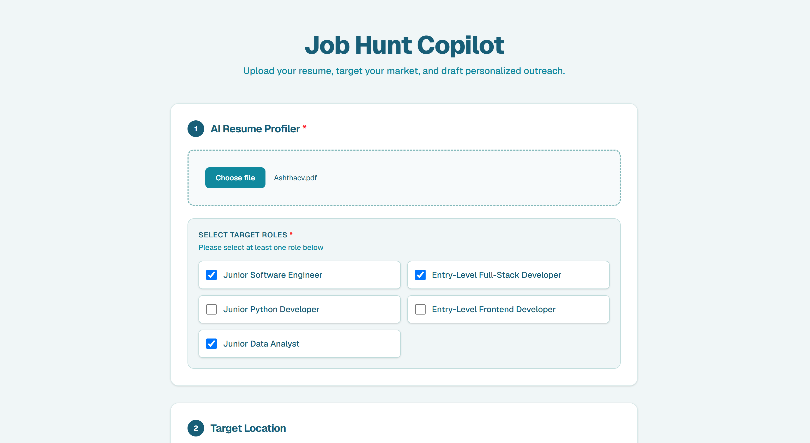
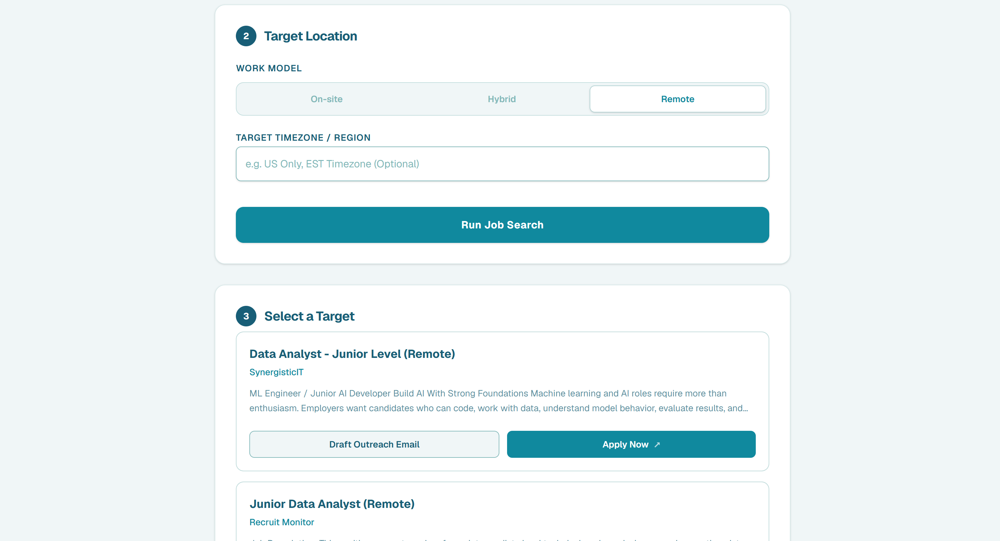
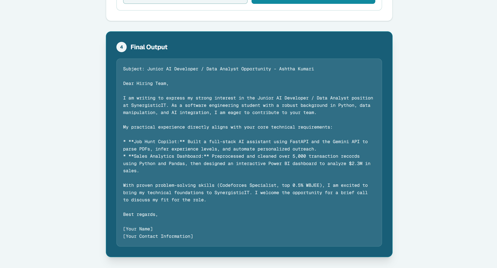

# Job Hunt Copilot

An AI job search assistant that turns a resume PDF into targeted job matches and personalized recruiter outreach.

**Live demo:** [job-hunt-copilot-nine.vercel.app](https://job-hunt-copilot-nine.vercel.app/)

---

## What it does

Job hunting involves a lot of repetitive work: figuring out which titles you're actually eligible for, running the same search across several roles and cities, and writing outreach one email at a time. This app handles all three from a single resume upload.

**1. AI Resume Profiler** — Upload a resume PDF. The backend extracts the text, validates it's genuinely a resume, and asks Gemini to infer the candidate's experience level and suggest five realistic job titles. Seniority is constrained by experience, so a candidate with under two years only ever sees Junior and Entry-Level suggestions.

**2. Job Search** — Pick target roles and up to three cities, or switch to Remote. The backend fans out every role × location combination as concurrent requests to SerpApi's Google Jobs engine, deduplicates the results, and returns a single consolidated feed.

**3. Outreach Generator** — For any job in the results, Gemini drafts a cold outreach email under 150 words, cross-referencing the job description's core requirements against the candidate's actual projects.

---

## Screenshots

<!-- Add your screenshots to a screenshots/ folder and they'll render here. -->







---

## Tech stack

| Layer | Stack |
|---|---|
| Frontend | Next.js (App Router), TypeScript, Tailwind CSS |
| Backend | FastAPI, Python |
| AI | Google Gemini (`google-generativeai`) |
| Job data | SerpApi — Google Jobs engine |
| PDF parsing | PyPDF2 |
| HTTP client | httpx (async) |
| Hosting | Frontend on Vercel, backend on Render |

---

## Architecture

```
job-hunt-copilot/
├── frontend/           # Next.js client (App Router, TypeScript, Tailwind)
├── main.py             # FastAPI app — all API routes
└── requirements.txt    # Python dependencies
```

The Next.js client is a single-page stepped flow holding all state client-side; it calls the FastAPI backend over REST. Both API keys (Gemini, SerpApi) live server-side only and are never exposed to the browser.

### API

| Method | Route | Purpose |
|---|---|---|
| `GET` | `/` | Health check |
| `POST` | `/upload-resume` | Accepts a PDF upload; returns extracted text and five suggested job titles |
| `GET` | `/search-jobs` | Query params `role` and `location`; returns a deduplicated job feed |
| `POST` | `/generate-outreach` | Accepts job description, resume text, company, and role; returns a drafted email |

**`POST /upload-resume`** — multipart file upload. Rejects PDFs over two pages, rejects documents whose extracted text is under 50 characters (image-based scans), and prompts Gemini to return the sentinel `["INVALID_RESUME"]` for documents that aren't resumes, which the handler catches before anything reaches the frontend.

**`GET /search-jobs`** — roles arrive pipe-joined as `"Role A OR Role B"` and locations as `"On-site in City A OR City B"`. The handler splits both, builds one SerpApi task per role × location pair, and runs them with `asyncio.gather`. Results are deduplicated on a `title-company` key and capped at ten per query.

**`POST /generate-outreach`** — JSON body validated by a Pydantic model (`job_description`, `resume_text`, `company_name`, `role_title`).

---

## Running locally

### Prerequisites
- Python 3.10+
- Node.js 18+
- A Google Gemini API key
- A SerpApi key

### Backend

```bash
git clone https://github.com/Ashtha613/job-hunt-copilot.git
cd job-hunt-copilot

python -m venv venv
source venv/bin/activate        # Windows: venv\Scripts\activate
pip install -r requirements.txt
```

Create a `.env` file in the project root:

```env
GEMINI_API_KEY=your_gemini_key_here
SERPAPI_KEY=your_serpapi_key_here
```

Start the server:

```bash
uvicorn main:app --reload
```

The API runs at `http://localhost:8000`, with interactive docs at `http://localhost:8000/docs`.

### Frontend

```bash
cd frontend
npm install
npm run dev
```

The client runs at `http://localhost:3000`. To point it at your local backend, change `API_BASE_URL` in `app/page.tsx` to `http://localhost:8000`.

---

## Design notes

**Validation happens before the AI call, not after.** Page count and extracted-text length are checked in Python first, so malformed uploads never consume API quota. Only the "is this actually a resume?" question needs the model, and it's answered with a sentinel value the handler checks explicitly rather than by parsing prose.

**Seniority is constrained in the prompt.** Left unconstrained, the model suggested senior and lead titles to candidates with no experience. The prompt now requires a Junior or Entry-Level prefix below two years and forbids senior titles below five.

**Search is concurrent, not sequential.** Three roles across three cities is nine SerpApi calls; run in sequence that's a multi-second wait. `asyncio.gather` over `httpx.AsyncClient` collapses it to roughly the latency of the slowest single call, with `return_exceptions=True` so one failed query doesn't take down the whole search.

**Errors surface as messages, not stack traces.** The frontend inspects error strings for quota and timeout conditions and renders a human-readable banner, rather than leaving the user with a spinner that never resolves.

---

## Known limitations

- CORS is currently open to all origins — fine for a demo, would be restricted to the deployed frontend domain in production.
- Nothing is persisted; searches and generated emails are lost on refresh.
- The free Gemini tier has a daily request cap, which the UI surfaces when hit.
- SerpApi results are capped at ten jobs per query.

---

## Roadmap

- [ ] Persist saved jobs and search history in PostgreSQL
- [ ] Restrict CORS to the deployed frontend origin
- [ ] Support DOCX resumes alongside PDF
- [ ] Batch email generation across multiple listings
- [ ] Application status tracking

---

## Author

**Ashtha Kumari**

[GitHub](https://github.com/Ashtha613) · [Codeforces](https://codeforces.com/profile/Aashthaa)
